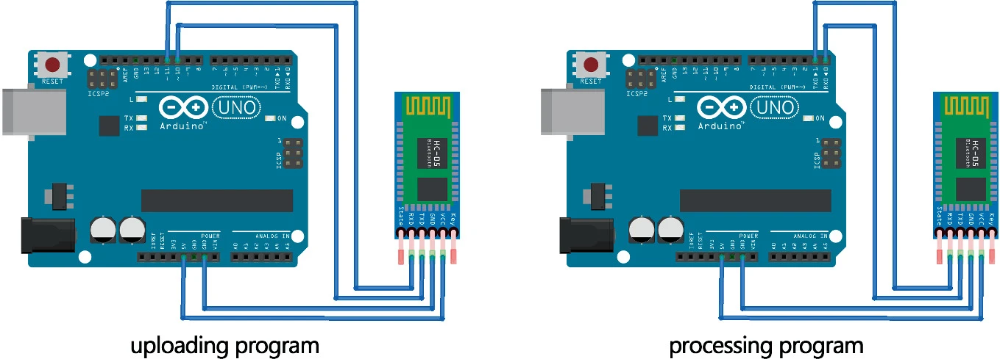

# 目录

[TOC]

# 摘要_TGAM

----------------------------------

- TGAM（ThinkGear AM）模块是一种基于干预-反应模（Intervention-Reaction Paradigm，IRP）及干扰消除技术的脑电信号采集设备，主要应用于心理状态监测、认知状态评估、注意力和专注度评估等方面。它可以通过无线方式获取人类大脑皮层的电活动信号，并通过信号处理算法将其转化为可供分析的数据。

# 介绍_TGAM

-----------------------------------------------------------

**ThinkGear Alpha Module**

TGAM模块主要原理：**振幅不对称性（Asymmetry）计算和特征提取分类。**TGAM模块主要通过振幅不对称性计算和特征提取分类，实现对脑电波信号的有效识别和分类。脑电信号由TGAM脑电模块实时监测

TGAM（ThinkGear Alpha Module）由Neurosky公司开发基于脑电波的生物反馈设备，它可以通过测量人脑的神经信号，实现对人脑状态的监测和控制。在脑电波的角度，TGAM模块可以实现对Alpha波、Beta波、Theta波、Delta波等多种不同频率的脑电波进行监测，这些脑电波的出现与人脑的不同状态相关。TGAM技术识别这些波可以将脑电波信号按照时间分段，并分别计算各时间段内正向和负向振幅的平均值，并将它们相除来得到振幅不对称性(Asymmetry）。通过计算每个时间段内不同类型脑电波的**振幅不对称性（Asymmetry）**，**并将它们连接起来形成一个序列**，接着通过对这个序列进行**特征提取和分类**，可以实现脑电波信号的识别和分类。总之，TGAM技术是一种**基于脑电波信号的特征提取和分类方法**，可以用于识别不同类型的脑电波信号。TGAM在脑电波上识别不同类型的脑电波信号，进一步探究脑电波与认知、情感等方面的关系。TGAM芯片可将信号转换为数字信号进行处理，之后通过电极头带与人脑进行连接，电极头带可以测量人脑的电信号并将信号传输给TGAM芯片。TGAM模块的工作原理是通过测量不同区域的脑电信号，并将其转换为数字信号进行处理和分析，以实现对人脑状态的监测和控制。

​	**1.振幅不对称性计算**

TGAM模块首先将原始脑电波信号按时间窗口分段处理，每个时间窗口内包含若干个采样点。对于每个时间窗口，TGAM模块将其中的正向振幅和负向振幅分别计算平均值，然后将它们相除得到振幅不对称性，即：

Asymmetry = (mean positive amplitude) / (mean negative amplitude)

这样就得到了一个振幅不对称性的值，用来表示这个时间窗口内脑电波信号的特征。

​	**2.特征提取分类**

接下来，TGAM模块将所有时间窗口的振幅不对称性值按时间顺序连接起来，形成一段序列。对这个序列进行特征提取和分类，可以用于识别不同类型的脑电波信号。常用的特征提取方法包括小波分析、时频分析、熵分析等，常用的分类方法包括支持向量机、人工神经网络、贝叶斯分类器等。

需要注意的是，TGAM模块的振幅不对称性计算和特征提取分类是针对每个电极的脑电波信号进行的，不同电极之间的振幅不对称性和特征可能存在差异，需要进行多电极分析和整合。同时，若要提精度还需要对噪声进行处理，如滤波、去除运动伪影等，以提高信号质量和可靠性。

以TGAM模块分析的人体脑电信号中Meditation值和Attention值的具体指标为优化目标，我们将开发基于脑电信号的实时交互式空间元素优化工具平台。工具平台由硬件系统和软件系统组成。TGAM脑电模块会在实验过程中通过蓝牙实时不断发送人体脑电信号。通过Arduino开发板对脑电信号进行预处理，将处理后的冥想值和注意力值发送至电脑串口。利用计算机运行优化程序。

# 参考波

------

α波为主

## Alpha波(α波_*阿尔法波*)

Alpha波是我们有**意识的思维**（Beta）和**潜意识**（Theta）之间的 “频率桥梁”。

- Alpha波是脑电信号中的一种频率为8-13Hz的电波，常出现在脑电图（EEG）中，通常在人处于放松、静坐、闭目、心情愉悦、沉思等情境下出现。Alpha波在脑电信号中具有较高的振幅和稳定性，是一种较为显著的脑电信号。Alpha波的出现与大脑皮层活动的同步性和相干性有关，其主要来源于大脑皮层的顶枕区，是一种相对低能量、高同步、高相干的脑电信号。一般来说，Alpha波的出现与放松、注意力集中、思维活跃等状态有关，但在某些精神疾病或脑部损伤的情况下，Alpha波的出现可能会发生改变。对于研究人类大脑的认知、情感、运动控制等方面具有重要的意义。

- Alpha波在心理学和神经科学中的研究领域十分广泛，例如在神经反馈治疗中，可以通过增加Alpha波的出现来促进放松和降低焦虑；在认知神经科学中，可以利用Alpha波研究注意力和记忆等认知功能；在脑机接口中，可以利用Alpha波实现脑机交互。

## Beta波(β波_*贝塔波*)

Beta波是人们在清醒中最常见的高频波。

- Beta波是脑电信号中的一种频率为13-30Hz的电波，常出现在脑电图（EEG）中频率在13-30赫兹之间的电波。通常在人处于警觉、专注、思维活跃等情境下出现。Beta波的出现与大脑皮层活动的不同步性和不相干性有关，其主要来源于大脑皮层的额区和顶区，是一种相对高能量、低同步、低相干的脑电信号。Beta波的出现与警觉状态、注意力集中、思维活跃等状态有关，同时也与情绪激动、压力、焦虑等负面情绪状态有关。在某些精神疾病或脑部损伤的情况下，Beta波的出现可能会发生改变。因此，Beta波是脑电信号中的一种重要成分，对于研究人类大脑的认知、情感、运动控制等方面具有重要的意义。
- Beta波在心理学和神经科学中的研究领域十分广泛，例如在神经反馈治疗中，可以通过减少Beta波的出现来减轻焦虑和过度兴奋；在认知神经科学中，可以利用Beta波研究执行和控制等认知功能；在脑机接口中，可以利用Beta波实现脑机交互。

## Theta波(θ波_*西塔波*)

Theta波又被称为 “**受暗示波**”，因为它普遍存在于人们**精神恍惚或者是催眠状态**

- Theta波是脑电信号中的一种频率为4-8Hz的电波，通常在人处于深度放松、沉睡、冥想、创造性思维等情境下出现。Theta波的出现与大脑皮层活动的同步性和相干性有关，其主要来源于大脑皮层的颞（cuan）区和顶区，是一种相对低能量、高同步、高相干的脑电信号。Theta波的出现与深度放松、冥想、创造性思维等状态有关，同时也与情绪稳定、注意力、记忆等方面有关。在某些精神疾病或脑部损伤的情况下，Theta波的出现可能会发生改变。因此，Theta波是脑电信号中的一种重要成分，对于研究人类大脑的认知、情感、运动控制等方面具有重要的意义。

- Theta波的出现和脑内神经元的活动有关，它主要来自于海马和内侧顶叶等脑区的神经元同步活动，但也可能受到其他脑区的影响。

  Theta波在心理学和神经科学中的研究领域十分广泛，例如在神经反馈治疗中，可以通过增加Theta波的出现来促进放松和降低焦虑；在认知神经科学中，可以利用Theta波研究学习和记忆等认知功能；在脑机接口中，可以利用Theta波实现脑机交互。同时，一些研究还发现Theta波与情绪、意识和自我体验等方面有关，是未来神经科学和心理学研究的重要方向之一。

## Gamma波(γ波_*伽玛波*)

不予以考虑

## Delta波(**δ波**_*德尔塔波*)

Delta波与我们**深层次的放松和恢复性睡眠**相关，或许我们只需把 "Delta" 想象成 “深”，因为它们是人类史上有记录的**最慢的脑电波**。

## 波_情绪图

## 脑电精神超控

[image.webp](https://postimg.cc/dkr32HHz)

# 应用_基于TGAM

----------------------------------------------

## 1.注意力和专注度评估

- TGAM模块可以通过监测大脑皮层中的特定频率范围内的电活动来评估个体的注意力和专注度水平。在进行注意力训练时，通过对参与者进行实时的脑电信号分析，可以在他们的注意力分散时给出及时的反馈，以促进他们的注意力和专注度水平的提高。

## 2.心理状态监测

- TGAM模块可以检测出脑电信号中的一些特定模式，例如<u>**Alpha波**</u>和<u>**Beta波**</u>等，这些模式可以反映出个体的心理状态，如放松、专注、兴奋和疲劳等。因此，将TGAM模块应用于个体的心理状态监测，在需要时提供适当的支持。
- 脑电信号可以反映出人类大脑的活跃状态和功能异常，因此可以通过分析脑电信号来诊断一些精神疾病，如焦虑症、抑郁症等。基于TGAM模块的脑电信号采集和处理技术可以为精神疾病的诊断提供辅助手段。
- 脑电信号可以反映出人类大脑的睡眠状态和睡眠质量，因此可以通过分析脑电信号来研究睡眠障碍、睡眠质量等问题。基于TGAM模块的脑电信号采集和处理技术可以为睡眠研究提供数据支持。

## 3.认知状态评估

- TGAM模块可以根据特定的脑电信号模式来评估个体的认知状态。例如，通过分析<u>**Theta波**</u>在个体的大脑皮层中的出现频率和强度，可以评估个体的认知状态，如记忆力和思维能力等。
- 脑电信号可以反映出人类大脑的认知活动，如注意力、记忆、语言等。基于TGAM模块的脑电信号采集和处理技术可以为认知研究提供数据支持，深入研究人类大脑的认知机制。

## 4.脑机接口应用

- TGAM模块可以通过将脑电信号转换成计算机可以处理的数字信号，实现脑机接口（Brain-Computer Interface，BCI）应用。例如，在游戏中，通过对个体的脑电信号进行实时的分析和处理，可以实现通过思维控制游戏角色的目的。
- 脑机接口是一种将脑电信号转化为机器指令的技术，可以实现通过思维控制外部设备的功能。基于TGAM模块的脑机接口应用场景包括残疾人辅助设备、虚拟现实游戏等。

## 5.运动控制

- 脑电信号可以反映出人类大脑的肢体运动意图，因此可以通过分析脑电信号来实现肢体运动控制。基于TGAM模块的脑电信号采集和处理技术可以为肢体运动控制提供技术支持。实现对设备的控制。例如，当人脑处于放松状态时，控制算法可以控制电动轮椅或机器人向前移动，当人脑处于集中注意力状态时，控制算法可以控制游戏进程的前进或停止等。 总之，利用TGAM实现控制的过程是通过采集、处理、特征提取、控制算法和设备控制等多个环节完成的，其中需要使用多种技术和算法，以实现对设备的精准控制。

# 开发_TGAM

------------------------------------------------------------------------------

*这里做出TGAM优劣，同时以下为具体开发处理板块。*

- 优势： TGAM模块结构简单，使用方便，具有低功耗、高精度、高灵敏度等优点。因此，TGAM模块在脑电波方面的应用十分广泛。可以克服信号干扰、抗噪性能好，能够对不同类型的脑电波信号进行有效的识别和分类。

- 劣势：信号的时间分辨率和空间分辨率受限，可能存在信号模式的混淆，还需要进一步探究脑电信号与具体认知和情感过程的关系。*改进并结合其他脑电波信号处理和分析方法。*

  

## TGAM模块处理

---------------------------------------------------------

首先，TGAM模块将原始的脑电波信号按时间窗口分段处理，每个时间窗口内包含若干个采样点。接下来，针对每个时间窗口，TGAM模块将其中的正向振幅和负向振幅分别计算平均值，并将它们相除得到振幅不对称性。振幅不对称性的计算方法是基于假设，即某种类型的脑电波信号在一段时间内会表现出明显的正向振幅或负向振幅，因此正向振幅和负向振幅的差异可以用来表示该时间窗口内脑电波信号的特征。计算得到的振幅不对称性值越大，代表正向振幅或负向振幅的偏离程度越大，表明该时间窗口内的脑电波信号与特定的类型有更高的相关性。

接着，TGAM模块将所有时间窗口的振幅不对称性值按时间顺序连接起来，形成一段序列。对这个序列进行特征提取和分类，可以用来识别不同类型的脑电波信号。常用的特征提取方法包括小波分析、时频分析、熵分析等，常用的分类方法包括支持向量机、人工神经网络、贝叶斯分类器等。在特征提取时，TGAM模块需要选择合适的特征集合来描述振幅不对称性序列的统计和时频特征。在分类时，TGAM模块会将特征向量输入到分类器中进行训练和识别，得到脑电波信号的类型和类别。

## TGAM模块组成

----------------------------------------------------------------------------

TGAM（ThinkGear AM）模块的工作原理基于脑电生物学和神经科学，在测量人脑的电信号方面具有高精度和高灵敏度。TGAM模块主要由两个部分组成：电极头带和TGAM芯片。

TGAM（ThinkGear AM）模块是一种脑机接口设备，可通过测量人脑的神经信号实现对人脑状态的监测和控制。该模块主要由两部分组成：电极头带和TGAM芯片。
电极头带是一种可穿戴设备，可将电极附着到头皮上，并将人脑的电信号传输到TGAM芯片中。电极头带上通常包括几个电极，可测量不同区域的脑电信号。这些电极会将人脑的电信号转换为电压信号，并将其传输到TGAM芯片中。
TGAM芯片是一种基于神经科学的芯片，可将电压信号转换为数字信号进行处理。TGAM芯片中包括多个传感器，可测量不同频率的脑电波。芯片中的算法可将这些脑电波信号转换为数字信号，以供后续处理和分析。
在使用TGAM模块时，用户通常需要将电极头带佩戴在头上，并将TGAM模块连接到计算机或移动设备上。用户可以使用相应的应用软件监测和分析脑电波信号，并通过反馈信号帮助用户控制自己的情绪和行为。

在使用TGAM模块时，用户可以通过相应的应用软件实时监测和分析脑电波信号，并通过反馈信号帮助用户控制自己的情绪和行为。

## TGAM处理步骤

-----------------------------------------------------------------

1. 采集脑电信号：TGAM通过传感器采集人脑的脑电信号，反映出人脑的状态，例如注意力、放松、冥想等。
2. 信号处理：TGAM将采集到的脑电信号进行处理，例如滤波、放大、降噪等，将处理后的信号转换为数字信号，以便后续处理和传输。
3. 特征提取：TGAM根据采集到的信号，提取其中的特征，例如Alpha波的能量、Theta波的频率等，用来反映人脑的状态。
4. 控制算法：TGAM根据特征提取的结果，使用控制算法进行计算和分析，例如使用机器学习算法或其他控制算法，确定人脑状态与设备控制之间的关系。
5. 设备控制：TGAM将控制算法的结果传输给计算机或其他设备。

  

-------------------------------------------------------------

## Meditation

*Meditation值和Attention值是人体脑电信号中的两个指标，用于反映人的冥想和注意力水平。*

- 
  Meditation值指的是脑电波中Theta和Alpha波的比率，这个比率越高，说明人的脑电波中Theta波的占比越大，而Alpha波的占比越小，表明人的大脑处于一种放松、冥想的状态。因此，Meditation值越高，说明人的冥想状态越深入。

## Attention

- Attention值指的是脑电波中Beta波的占比，这个比率越高，说明人的脑电波中Beta波的占比越大，表明人的大脑处于一种高度集中、注意力高度集中的状态。因此，Attention值越高，说明人的注意力水平越高。
  通常，Meditation值和Attention值是通过脑电信号采集装置进行采集和计算得出的，这些数值可用于评估一个人的冥想和注意力水平，并可以用于脑机接口、生物反馈治疗、认知训练等多个领域的应用。

-------------------------------------------------------------------

## TGAM软硬件&算法处理

**软硬平台**

TGAM脑电模块会在实验过程中通过蓝牙实时不断发送人体脑电信号。通过Arduino开发板进行预处理，处理后的冥想值和注意力值发送到电脑的串口。计算机运行优化程序，例如，脑电图采集设备包括使用 TGAM 芯片的 BrainLink Pro 和使用 Open BCI 芯片的 DIY Neurotechnologist's Starter Kit。Oculus Rift S 和 HTC Vive 都有很好的兼容性。另外，推荐的电脑硬件配置是配备独立显卡的高性能电脑。

在软件平台上，通过在Arduino ide中编写C语言完成Arduino开发板上传程序的预处理。其目的是对TGAM脑电模块传来的原始脑电数据进行采集和处理，将十六进制转换成二进制语言输入计算机串口。由于 Grasshopper 可以与多种编程语言合作，适合构建参数化模型，因此本研究使用 Grasshopper 平台进行优化算法。在该平台上，本研究利用串口读取的数据作为实时优化算法的参考

**Arduino 开发板程序上传方法**

基于TGAM脑电模块的脑电信号需要在Arduino开发板中进行预处理，使Arduino开发板能够实时读取脑电数据，捕获TGAM模块中的注意力值和冥想值，然后传输他们通过串行端口到 Grasshopper 平台。

在此之前，它需要将程序上传到Arduino板。Arduino板上接收TGAM脑电模块的脑电方式为蓝牙接收。程序上传时管脚连接方式为Arduino 5 V—VCC；Arduino GND——GND；Arduino Pin10—TXD；Arduino Pin11—RXD。上传完成后，将TXD和RXD分别接到pin0和pin1上（图 [3](https://i.postimg.cc/QMVVJf7Q/arduino01.webp)）。

​										图 3

优化算法在 Grasshopper 平台上的适配

TGAM脑电模块通过前额叶电极采集受试者的脑电信号，通过模块计算每秒发送受试者当前的冥想值和注意力值。两者的取值范围都在0到100之间。本研究希望通过优化计算得到能够使人具有较高冥想值和较低注意力值的空间，以减轻人在环境中的紧张感和焦虑感，增加放松感。

实验过程中，为保证实验者在观察时能对场景产生更合理的脑电反馈，每个场景在实验者面前停留5 s，舍弃第一秒和最后一秒的脑电值，取平均值中段脑电值作为遗传算法（目标）的参考值。

​																							(1)

基于此，实验过程中每5秒可生成一组脑电处理数据，作为优化算法的优化参考。因此优化算法在优化计算过程中需要等待。在这里，问题是由“时间”解决的。睡眠（5）”算法。在其他计算停止5s的时间内，冥想值和注意力值会累计5s的数据，在5s结束时，将其作为列表输入，计算平均值（1）。计算过程的时间经过多次测试证明在0.5s以内，低于平均计算时丢弃的前一秒的时间，并且不会与时间叠加，所以不会影响优化算法的准确性。数字 [图4](https://link.springer.com/chapter/10.1007/978-981-19-8637-6_11#Fig4)为实验操作界面。

# 采购参考规格(NeuroSky)

------------------------------------------

TGAM模块可以处理并输出脑波频率谱，脑电信号质量，原始脑电波和三个Neurosky的eSense参数：专注度，放松度和眨眼侦测。和人体的界面只需一个简单的干接触点，所以可以很容易的运用于玩具，视频游戏和健康设备中，又由于能耗小，适合用在以电池供电的便携式消费产品的应用上。

TGAM模块的特点及优势 • 能直接连接干接触点，不像传统医学用的湿传感器使用时需要上导电胶 • 单EEG脑电通道有3个接触点：EEG（脑电采集点）REF（参考点）GND（地线点） • 上电后若接触点连续四秒没有采集到脑电或连续七秒收到差的脑电信号， 本智慧模块会通过“信号质量强度”发出信号差的警告，提醒用户调整传感器 • 先进的噪音过滤技术，能抗拒日常生活中环境里的各种干扰 • 低能耗，适合便携式消费产品的电池供电的设备 • 3.3伏供电下最大消耗为15毫安 • 原始脑电数据以512 Hz输出

------------------------------------------------------------------------

测量

• 原始脑波信号 • 处理和输出α,β等脑波波段数据 • 处理和输出Neurosky（神念科技）获得专利技术的eSense专注度和放松度指数以及未来开发的其他数据 • 嵌入式的信号质量分析功能能警告接触不良或是完全没接触的异常状态 • 眨眼侦测

物理规格 • 规模尺寸（最大）2.79cm x 1.52cm x 0.25cm • 重量（最大）130mg

规格说明 • 采样率： 512Hz • 频率范围：3Hz-100Hz • 静电保护：4kV接触放电; 8kV隔空放电 • 最大消耗功率：15毫安 @ 3.3伏 • 运行电压：2.97~3.63伏

UART（串口）标准输出接口 • 1200, 9600, 57600 输出波特率 • 8 bits • No parity • 1 stop bit AC交流噪音滤波器的配置选项 • 50Hz • 60Hz

-------------------------------------------------------

ADS1299脑电采集芯片，高精度、多通道。

数据处理可以直接使用matlab的工具箱EEGLAB或者OPENVIBE

又或使用专用脑电EEG芯片，外加控制器外围实现系统。此类芯片如国外的TI ADS1299芯片，略贵。国内芯森微电子的KS1092芯片可以实现双路信号采集，性价比较高。

[tgam模块 - 京东 (jd.com)](https://www.jd.com/hprm/16729eba89fa21622957.html)

# 参考文献

------------------------------------------------------------------------------

*以下不分先后顺序*

- 脑电图(EEG)学习网络模型(EEGNet)[基于卷积神经网络模型架构开发](https://link.springer.com/article/10.1007/s13042-023-01793-x)

- [信号多输入单输出算法优化设计-2022/10/14](https://link.springer.com/article/10.1007/s13042-023-01793-x)

- [脑电超精神控制实现-2022/06/11](https://link.springer.com/article/10.1186/s43593-022-00016-0)

- 

- [基于单前额脑电图的注意力评估](https://link.springer.com/chapter/10.1007/978-981-10-8854-4_23)

- [消费级脑机接口系统-成本问题](https://link.springer.com/chapter/10.1007/978-981-16-8048-9_8)

- [基于消费级 EEG 设备的运动想象估计-链接骨骼运动可参考-成本问题](https://link.springer.com/chapter/10.1007/978-3-030-62460-6_27)

- [基于检测操作者大脑脑电图信号的新型图像处理系统的开发：可行性研究-切换](https://link.springer.com/article/10.1007/s12194-019-00508-8)

  介绍：这里实现的是对图片进行操作，利用的是眼部肌肉控制，但是这里的系统可以参考为上下切换翻页到上下切换音乐，不过这里使用的将会是脑电转化为机器语言后进行的操作

- [情绪识别中的脑电图处理：灵感来自音乐五线谱](https://link.springer.com/article/10.1007/s11042-022-13405-x)

  介绍：这里将情绪状态的识别提高10.1%，保留了EEG时的频特征，技术是构建了一个多通道EEG传感器来测量个体

- [神念TGAM模块+树莓派GPIO控制灯泡（脑电波控制物联网应用示例）](https://blog.csdn.net/weixin_35641414/article/details/91454633)

  介绍：实现架构及相关代码，对于代码控制面可以予以参考价值，此外针对脑波小车的概念代码[开源笔记]([基于神念TGAM的脑波小车（1） - 其实，我就在你方圆几里 - 博客园 (cnblogs.com)](https://www.cnblogs.com/fangyuanjili/archive/2018/04/01/8687844.html))

- 针对项目开发完整思路，这里使用arduino,[链接](https://www.jianshu.com/p/392b80e8ea87)

- 硬件参考：

  - [TGAM组装](https://feater.top/tgam/setup-and-installation-of-tgam-module)
  - [TGAM（脑波传感器）+Arduino如何开发编程 (baidu.com)](https://baijiahao.baidu.com/s?id=1731314205270302367)

- [MindViewer-TGAM模块数据图形化软件](https://zhuanlan.zhihu.com/p/379460724)

- [【开源项目】基于神念TGAM的脑波灯](https://blog.csdn.net/redeemer_Qi/article/details/108253582)

- “基于神念TGAM的脑波小车”的项目：https://www.cnblogs.com/fangyuanjili/archive/2018/04/01/8687844.html 

  ​	解包的步骤：https://blog.csdn.net/y786256773/article/details/80167900

- 提升ThinkGear AM（TGAM）脑电模块对应的冥想值。Grasshopper 平台上有很多优秀的优化算法，比如 Galopalos、Octopus、Wallacei 等。Wallacei[脚注2](https://link.springer.com/article/10.1007/s44223-022-00017-6#Fn2)，基于NSGA-II算法，在本研究中被选中。Wallacei在结果的选择和优化，以及优化后的结果分析方面具有很强的优势，并采用k-means方法作为聚类算法，有利于对大量样本数据的分析。[具体计算](https://link.springer.com/article/10.1007/s44223-022-00017-6)

- Wallacei 由 Mohammed makki、Milad showkatbakhsh 和 Yutao song 开发。

---------------------------------------------------------------------

# 后续项目进行参考

------------------------------------------------------------------

或者考虑时间取消进行可以再做打算

### 步骤模块处理

脑电采集模块，单片机处理模块，上位机波形显示模块，数据处理模块。

### 脑机OpenBCI

### 脑电通讯

[通过非侵入式脑机超表面平台实现人脑直接无线通信](https://link.springer.com/article/10.1186/s43593-022-00019-x)